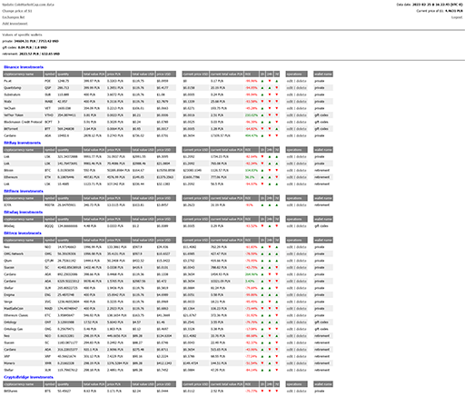

# Crypto-Index
> Calculate your cryptocurrency investments ROI's in few seconds. Just enter your investments' details and automatically get newest data from CoinMarketCap.com to calculate your current ROI's.
>
> 
>
> **Attention**: tool was designed to use PLN as major currency and USD as auxiliary. Of course ROI's will be calculated properly for any currency, however GUI has sense only for PLN and USD.
>
> **Warning**: you won't be able to remotely manage your cryptocurrency exchanges' accounts with this tool.

## Table of Contents
* [General Info](#general-information)
* [Technologies Used](#technologies-used)
* [Features](#features)
* [Setup](#setup)
* [Project Status](#project-status)

## General Information
- Crypto-Index is a single-user tool, that allows any cryptocurrency investor to hold its calculations in one place. Index looks clear also on mobile phones, so you can calculate your ROI's via mobile browser.
- You'll never again have to calculate your multiple investments in Excel or Calc. All you need is to enter your investments' details once, and then just update cryptocurrencies' prices with one-click mechanism. ROI's will be calculated automatically.
- No matter on how many exchanges you've placed your investments, you'll clearly see what are your current ROI's and that will help you to make further decisions.
- All your data will be stored on your private hosting and secured with password.
- This tool is response for my own needs as cryptocurrency investor. I wanted to know ROI's of all of my investments anytime even without having access to my laptop.

## Technologies Used
- PHP 7.4.26
- MySQL 5.7.36
- cURL
- HTML
- CSS
- JavaScript

## Features
List the ready features here:
- Adding investments; enter cryptocurrency purchase details, so tool could calculate your current ROI.
- CoinMarketCap.com data update; just click once to get newest cryptocurrencies' prices.
- Exchanges list; enter names of all exchanges where you bought cryptocurrencies and you'll receive investments list for all of them.
- Price of $1; enter current exchange rate PLN/USD to improve ROI calculations.
- Wallets' summaries; get total values of specific wallets, even if their investments are places on different exchanges.
- Mysterious login page; even if anybody will get know your hostings name, he'll think it's just some programming playground.
- Safe login: one-user only-password without database connectivity.

## Setup
To run this tool properly you'll need server or hosting with PHP 7.4. (cURL and openSSL extensions activated) and MySQL 5.7.

1. Configure domain or subdomain.
2. Upload files to your FTP server.
3. Configure password; encrypt yout passphrase with MD5 and paste it into /lib/config.php
4. Configure CoinMarketCap PRO API Key; to run this tool you'll have to generate free CoinMarketCap PRO API Key at https://pro.coinmarketcap.com/signup. When you'll get it then paste the key into /lib/config.php
5. Create empty MySQL database and run SQL commands from file db_structure.sql
6. Enter database details into into /lib/db.php
7. Login with your password and immediately run "Update CoinMarketCap.com data".
8. Enter PLN/USD exchange rate using "Change price of $1" feature.
9. Enter at least one exchange name using "Exchanges list" feature.

Tools is ready! Now you can add your investments and see how many of them have positive ROI. Anytime you'll want to see fresh calculations, all you'll have to do is to run "Update CoinMarketCap.com data".

## Project Status
Project is: _no longer being worked on_, because I don't invest in cryptocurrencies anymore.
